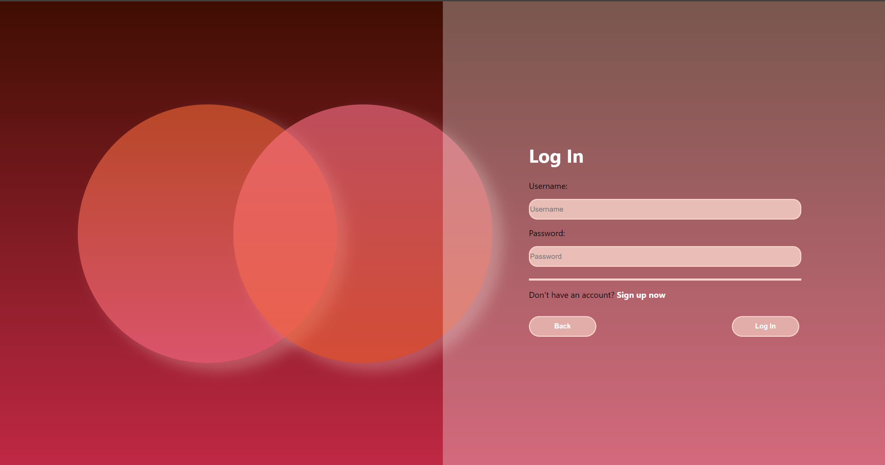
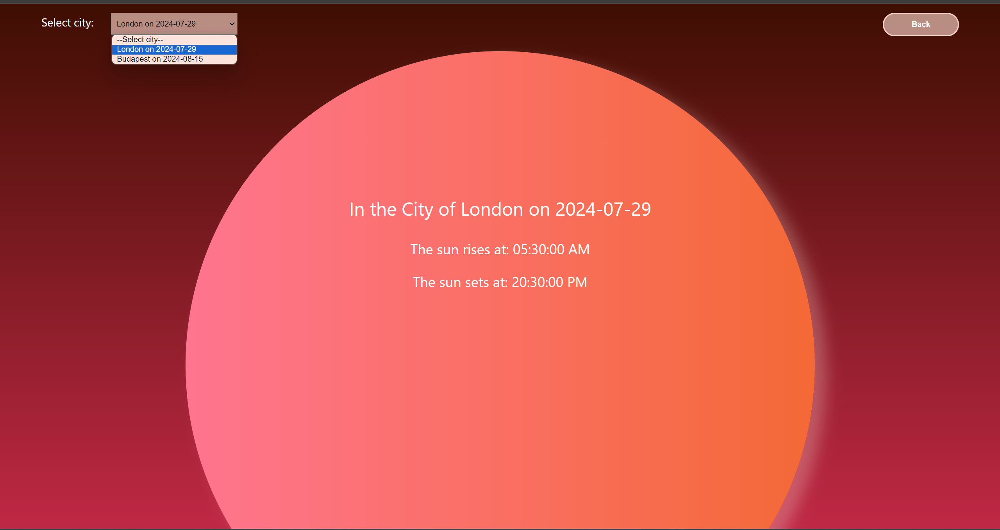
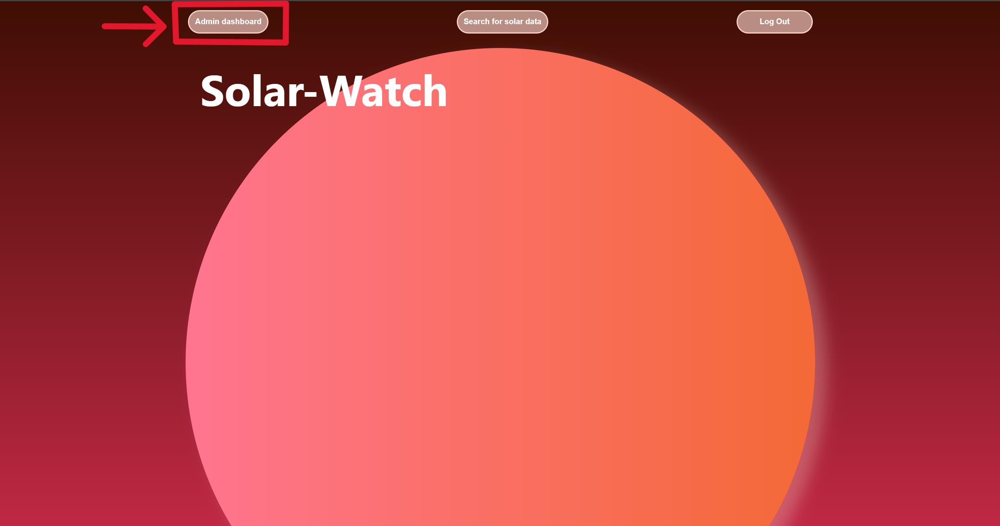
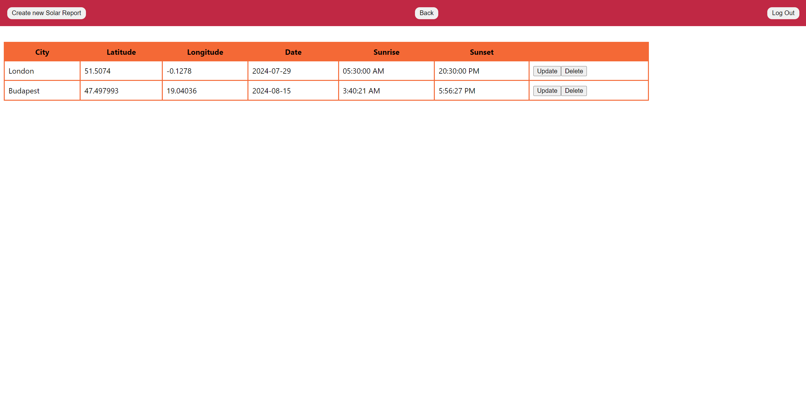

# SolarWatch Project
SolarWatch is a full-stack web application that allows users to retrieve sunrise and sunset data for a specific city and date. The data is fetched from the database, but if the data is not available, the application retrieves it from an external API. The application also supports user roles, allowing administrators to modify the data stored in the database.

## Features
### User Registration and Login:
Users can register and log in.

### Sunrise and Sunset Data Retrieval:
Users can search for sunrise and sunset data for a specific city and date.

If the data is not available in the database, the application fetches it from an external API.

### Database Management (Administrators Only):
Administrators can modify the sunrise and sunset data stored in the database accessed through the "admin dashboard" button that is only visible for them.

Admin dashboard:


## Technology Stack

### Frontend:
- [![React][React.js]][React-url]
- [![Css][Css3]][Css-url]
- [![Nginx][Nginx]][Nginx-url]

### Backend:
- [![spring-boot][spring-boot]][spring-boot-url]
- [![spring-web-mvc][spring-web-mvc]][spring-web-mvc-url]
- [![spring-web-mvc][spring-web-mvc]][spring-web-mvc-url]
- [![spring-data-jpa][spring-data-jpa]][spring-data-jpa-url]
- [![spring-security][spring-security]][spring-security-url]
- [![hibernate][hibernate]][hibernate-url]
- [![restful-api][restful-api]][restful-api-url]

### Database:
- [![postgresql][postgresql]][postgresql-url]

### Containerization:
- [![docker][docker]][docker-url]

### External APIs:
- https://sunrise-sunset.org/api
- https://openweathermap.org/api/geocoding-api

## Setup and Installation
### Local Setup
#### Prerequisites
Ensure the following are installed:
  - [![java][java]][java-url]
  - [![maven][maven]][maven-url]
  - [![postgresql][postgresql]][postgresql-url]
  - [![nodejs][node.js]][node-url]
  - [![npm][npm]][npm-url]

Clone the repository:
```bash
git clone git@github.com:CodecoolGlobal/solar-watch-docker-compose-java-eszti9902.git
```
- Navigate to the desired directory:
```bash
cd <directory>
```
- Backend Setup:
  - Navigate to the solarwatch_backend directory:
  ```bash
  cd solarwatch_backend
  ```
  - Set up your PostgreSQL database.
  - Update application.properties (src/main/resources/application.properties) with your database credentials and security data:
  ```bash
  POSTGRES_USER=your_db_user
  POSTGRES_PASSWORD=your_db_password
  POSTGRES_DB=your_db_name
  SPRING_DATASOURCE_USERNAME=your_db_user
  SPRING_DATASOURCE_PASSWORD=your_db_password
  CODECOOL_APP_JWTSECRET=your_jwt_secret
  CODECOOL_APP_JWTEXPIRATIONMS=your_jwt_expiration_time
  ```
*The JWT secret key should be 64 characters long and should only include alphanumeric characters (A-Z, a-z, 0-9). It is advisable to avoid using special characters such as -, /, +, and = to prevent potential issues with encryption and encoding.*
  - Build and run the Spring Boot application:
    ```bash
    mvn spring-boot:run
    ```

- Frontend Setup:
  - Navigate to the solarwatch_frontend directory:
  ```bash
  cd ../solarwatch_frontend
  ```
  - Install dependencies using npm:
  ```bash
  npm install
  ```
  - Run the React development server:
  ```bash
  npm start
  ```

### Docker Setup
  - Build and run the application:
  ```bash
  docker-compose up
  ```
  - The frontend will be accessible at http://localhost:3000.
- Environment Variables
  - Create a .env file in the root directory with the following environment variables:
```bash
POSTGRES_USER=your_db_user
POSTGRES_PASSWORD=your_db_password
POSTGRES_DB=your_db_name
SPRING_DATASOURCE_USERNAME=your_db_user
SPRING_DATASOURCE_PASSWORD=your_db_password
CODECOOL_APP_JWTSECRET=your_jwt_secret
CODECOOL_APP_JWTEXPIRATIONMS=your_jwt_expiration_time
```

*The JWT secret key should be 64 characters long and should only include alphanumeric characters (A-Z, a-z, 0-9). It is advisable to avoid using special characters such as -, /, +, and = to prevent potential issues with encryption and encoding.*


[React.js]: https://img.shields.io/badge/React-20232A?style=for-the-badge&logo=react&logoColor=61DAFB
[React-url]: https://reactjs.org/

[Css3]: https://img.shields.io/badge/Css-4361ee?style=for-the-badge&logo=css&logoColor=61DAFB
[Css-url]: https://en.wikipedia.org/wiki/CSS

[Nginx]: https://img.shields.io/badge/Nginx-38b000?style=for-the-badge&logo=nginx&logoColor=
[Nginx-url]: https://nginx.org/en/

[spring-boot]: https://img.shields.io/badge/SpringBoot-6DB33F?style=for-the-badge&logo=Spring&logoColor=white
[spring-boot-url]: https://spring.io/projects/spring-boot

[spring-web-mvc]: https://img.shields.io/badge/SPRING%20WEB%20MVC-6DB33F?style=for-the-badge&logo=Spring&logoColor=white
[spring-web-mvc-url]: https://docs.spring.io/spring-framework/reference/web/webmvc.html

[spring-data-jpa]: https://img.shields.io/badge/SPRING%20DATA%20JPA-6DB33F?style=for-the-badge&logo=Spring&logoColor=white
[spring-data-jpa-url]: https://spring.io/projects/spring-data-jpa

[spring-security]: https://img.shields.io/badge/Spring%20Security-6DB33F?style=for-the-badge&logo=springsecurity&logoColor=white
[spring-security-url]: https://spring.io/projects/spring-security

[hibernate]: https://img.shields.io/badge/Hibernate-59666C?style=for-the-badge&logo=hibernate&logoColor=white
[hibernate-url]: https://hibernate.org/

[docker]: https://img.shields.io/badge/Docker-2496ED?style=for-the-badge&logo=docker&logoColor=white
[docker-url]: https://www.docker.com/

[postgresql]: https://img.shields.io/badge/postgresql-4169e1?style=for-the-badge&logo=postgresql&logoColor=white
[postgresql-url]: https://www.postgresql.org/

[restful-api]: https://img.shields.io/badge/Restful%20api-3c096c?style=for-the-badge&logo=restful&logoColor=white
[restful-api-url]: https://restfulapi.net/

[java]: https://img.shields.io/badge/Java-17%2B-ED8B00?style=for-the-badge&labelColor=ED8B00&logo=java&color=808080[Java
[java-url]: https://www.java.com/en/

[maven]: https://img.shields.io/badge/Maven-4%2B-ED8B00?style=for-the-badge&labelColor=ED8B00&logo=maven&color=808080[Maven
[maven-url]: https://maven.apache.org/

[node.js]: https://img.shields.io/badge/Node.js-339933?style=for-the-badge&logo=nodedotjs&logoColor=white
[node-url]: https://nodejs.org/en

[npm]: https://img.shields.io/badge/npm-CB3837?style=for-the-badge&logo=npm&logoColor=white
[npm-url]: https://www.npmjs.com/